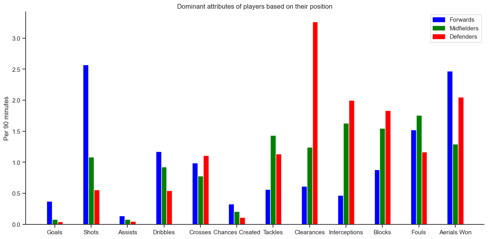
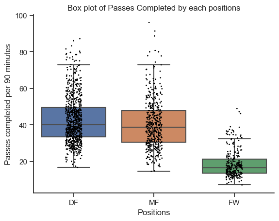
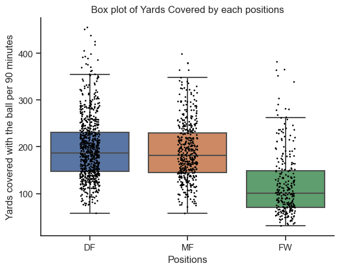
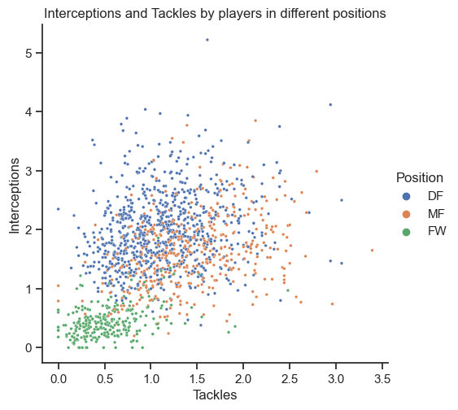
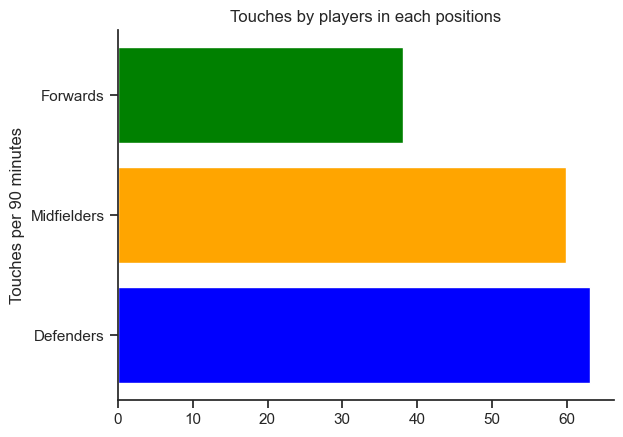

# Group 25A - "Joga Bonito" an analysis by Jesse Lazzari and Samin Intisar

## Introduction

This project stemmed from our passion as football fans, and when we stumbled upon statistics of all the footballers in the top 5 leagues, we knew we had to base our project on this dataset, and we were keen to explore it more! We hope to analyze different football players' statistics to compare the performances of the players in each of the leagues. We both thought it would be cool to analyze footballers, since there are a lot of unique statistics that people normally do not think of when considering how skillful a football player is. Our topics of interest include analyzing what attribute a player is dominant in given their position on the field and compare average player performance across the top 5 football leagues. This data was provided by the Premier League, Ligue 1, Bundesliga, Serie A and La Liga. It was created thanks to the public player stats records; the author of this dataset acknowledges as the source of all these player statistics. The dataset contains football player stats per 90 minutes, during the 2021-2022 football season.

## Exploratory Data Analysis Highlights

At first we decided to observe any correlations between various offensive and defensive stats. The lighter the color of the block in the heatmap, the better the correlation. We see that there is strong correlations between goals and shots, passes and touches, goal creating actions and assists, tackles and interceptions etc.

Here we have plotted a bar chart to figure out which attributes are dominated by each player positions. We can see that the stats that directly relate to involvement in the goal scoring are dominated by the forwards. These stats include goals, shots, assists and chances created. The more defensive attributes such as tackles, blocks, interceptions and clearances are dominated by the defenders. The midfielders show prowess in both the attacking and defensive attributes, but they do not dominate on any particular stats.

In this graph to explore one aspect of player performance we have grouped average red cards received per 90 minutes for players in each league. From this graph we can see that on average, players in Ligue 1 receive the most red cards out of all 5 leagues, whereas players in the Bundesliga league receive the least.

## Research Question 1

Our first research question is to find out what are the dominant attributes of the footballers in different positions. In order to do so, we had to group the 3 different positions and compare various stats between them. We expect that the forwards will dominate the attacking stats and the defenders will dominate the defensive stats. However, we were curious to find the how each positions performed in the more neutral stats of the game such as touches, passes, distance covered etc. Moreover we wanted to see how the midfielders performed in the game as their play-style is a mixture of attacking and defending.

From this box and whisker plot of pass completion stats, we can see that the defenders and midfielders pass the ball almost equally per 90 minutes. However, the forwards complete much less passes than the other two positions.

A similar trend is noticed when we look at the distance traveled with the ball by each positions. The forwards are doing much worse than the midfielders and defenders. The midfielders and defenders almost run the same distance with the ball.

The following scatter plot shows the number of tackles and interceptions done by players in each positions. As these are both defensive attributes, we could already expect the forwards to do much worse in both of them. The plots confirm our expectations. An interesting observation is that the midfielders are intercept more, but defenders are tackle more.

Here we are comparing a neutral stat- number of touches of the ball per 90 minutes. We would expect each positions to perform equally. However, we can again see that the forwards are doing worse than the other positions.

If you are interested you can [find the full analysis notebook here, including the code and the data here!](https://github.com/ubco-W2022T1-cosc301/project-group-25/blob/main/notebooks/analysis1.ipynb)

## Research Question 2

Our second research question is to compare average player performance across the top 5 football leagues, investigate the differences in playstyles between them, and conclude which league has the best performing players on average.
To compare the 5 different leagues, We have grouped player statistics that we believe are most relative when considering certain playstyles and player strengths on average

Aggressive Initiative points:

- Shots on target (Does not include penalty kicks)
- Shot-creating actions
- Number of players tackled
- Tackles in attacking 1/3

A league with a higher number of shots on target, shot creating actions, tackles and tackles in attacking zones are characteristics of a league with a more aggressive playstyle and has players which take more initiative in their play

From this graph we notice that Bundesliga and Ligue 1 have similar playstyles when it comes to aggressiveness, since these two leagues scored highest and have players who take the most offensive initiative on average.

Defensive points:

- Number of times blocking the ball by standing in its path
- Number of times blocking a shot by standing in its path
- Number of times blocking a shot that was on target, by standing in its path
- Number of times blocking a pass by standing in its path

A higher number of blocks, blocked shots, blocked shots on target, and blocked passes are characteristics of a league with better defensive play.

From this graph we can see that Serie A has the best defensive players on average, whereas Ligue 1 scored the lowest meaning their leagues playstyle constitutes less defensive play.

Reckless points:

- Yellow cards
- Red Cards
- Second yellow card
- Fouls committed
- Fouls drawn

A higher number of yellow cards, second yellow cards, red cards, fouls committed, and fouls drawn are characteristics of a league with a more reckless playstyle and less discipline.

From this observation we can see that La Liga scored the highest on this point system, concluding that this league was the least disciplined and has the most reckless playstyle, whereas the Premier League has the most disciplined players on average.

If you are interested you can [find the full analysis notebook here, including the code and the data here!](https://github.com/ubco-W2022T1-cosc301/project-group-25/blob/main/notebooks/analysis2.ipynb)

## Key Findings

Regarding our first research question, we can see a trend in passes completed, touches and distance covered. The midfielders and defenders dominate these attributes in the game. They are head-to-head with each other, whilst the forwards are lagging behind. When it comes to tackles and interceptions, we can again see that the forwards are contributing much less than the other two positions. However, we can observe in the scatter plot that defenders intercept more and midfielders tackle more. The forwards dominate on the attacking attributes such as goals, assists, shots and chances created.

Regarding our second research question, Bundesliga and Ligue 1 have similar playstyles when it comes to aggressiveness, since these two leagues scored highest on the initiative points aggregation, and thus have players who take the most offensive initiative on average. Bundesliga has the best defensive players on average, whereas Ligue 1 scored the lowest meaning their leagues playstyle constitutes less defensive play. La Liga scored the highest on the reckless points aggregation, concluding that this league was the least disciplined and has the most reckless playstyle, whereas the Premier League has the most disciplined players on average.

## Conclusion

When we compare what attribute a player is dominant in given their position on the field, midfielders and defenders have similar playstyles. They dominate on the same attributes and are weak in the same attributes. When it comes to most attributes, the forwards have less contribution. They spend less time on the ball and they touch the ball fewer times than everyone else. Overall, midfielders and defenders are more involved in the game. Therefore, we can conclude that in an average football match the forwards will be on-screen fewer times on screen than the rest. Additionally, as we compare average player performance across the top 5 football leagues, we can conclude that overall players from the Bundesliga league have the best performance on average. Since players from this league on average per 90 minutes scored the most goals, have the most assists, scored the highest on the Press statistic, receive the least number of red cards, were awarded the most defensive points, initiative points, and scored among the lowest on the reckless points aggregation.
