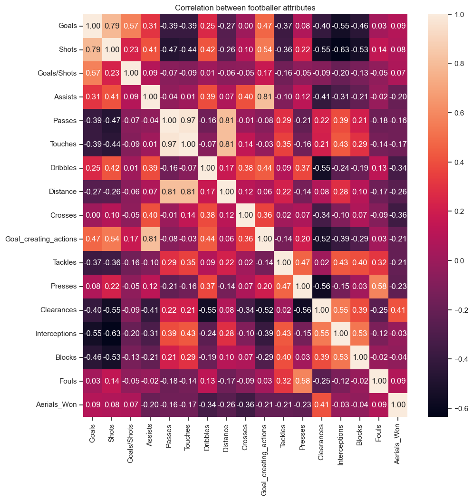
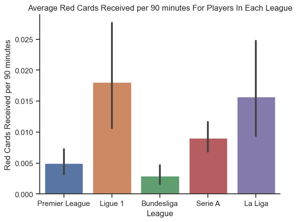
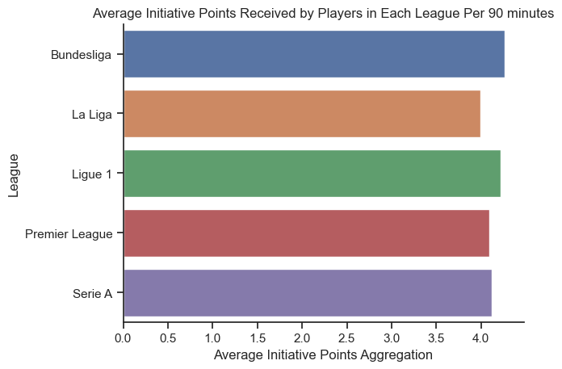
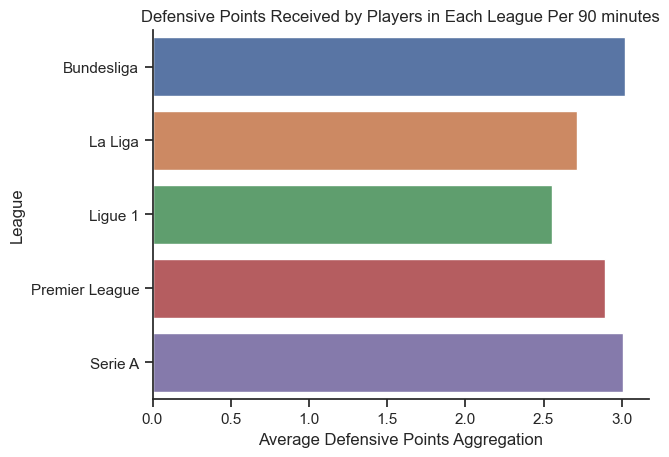
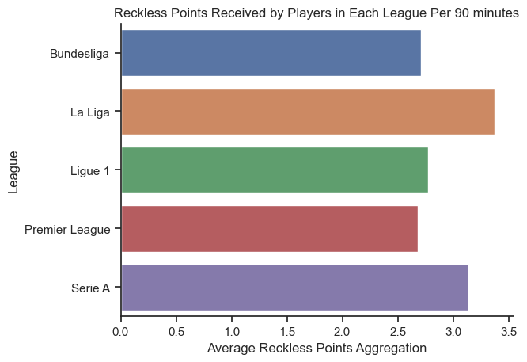

# Group 25A - "Joga Bonito" an analysis by Jesse Lazzari and Samin Intisar

## Introduction

This project stemmed from our passion as football fans, and when we stumbled upon statistics of all the footballers in the top 5 leagues, we knew we had to base our project on this dataset, and we were keen to explore it more! We hope to analyze different football players' statistics to compare the performances of the players in each of the leagues. We both thought it would be cool to analyze footballers, since there are a lot of unique statistics that people normally do not think of when considering how skillful a football player is. Our topics of interest include analyzing what attribute a player is dominant in given their position on the field and compare average player performance across the top 5 football leagues. This data was provided by the Premier League, Ligue 1, Bundesliga, Serie A and La Liga. It was created thanks to the public player stats records; the author of this dataset acknowledges as the source of all these player statistics. The dataset contains football player stats per 90 minutes, during the 2021-2022 football season.

## Exploratory Data Analysis Highlights

 ** to do, add eda highlights for question 1 **

Here we decided to observe if there were any correlations between notable offensive and defensive statistics, we see that there is strong correlation between the different blocking statistics and there appears to be correlation between shots on target and goals as well which is expected.

In this graph to explore one aspect of player performance we have grouped average red cards received per 90 minutes for players in each league. From this graph we can see that on average, players in Ligue 1 receive the most red cards out of all 5 leagues, whereas players in the Bundesliga league receive the least.

## Research Question 1

** to do: Question 1 + Results: Clearly state your research question and include 2-3 visualizations that helped you answer your research question. You can create multi-panel figures, but each of your visualizations must speak directly to your research question, and any insights you were able to get from it should be clearly articulated in the figure caption/description. **

If you are interested you can [find the full analysis notebook here, including the code and the data here!](https://github.com/ubco-W2022T1-cosc301/project-group-25/blob/main/notebooks/analysis1.ipynb)

## Research Question 2

Our second research question is to compare average player performance across the top 5 football leagues, investigate the differences in playstyles between them, and conclude which league has the best performing players on average.
To compare the 5 different leagues, I have grouped player statistics that I believe are most relative when considering certain playstyles and player strengths on average

Aggressive Initiative points:

- Shots on target (Does not include penalty kicks)
- Shot-creating actions
- Number of players tackled
- Tackles in attacking 1/3

A league with a higher number of shots on target, shot creating actions, tackles and tackles in attacking zones are characteristics of a league with a more aggressive playstyle and has players which take more initiative in their play

From this graph we notice that Bundesliga and Ligue 1 have similar playstyles when it comes to aggressiveness, since these two leagues scored highest and have players who take the most offensive initiative on average.

Defensive points:

- Number of times blocking the ball by standing in its path
- Number of times blocking a shot by standing in its path
- Number of times blocking a shot that was on target, by standing in its path
- Number of times blocking a pass by standing in its path

A higher number of blocks, blocked shots, blocked shots on target, and blocked passes are characteristics of a league with better defensive play.

From this graph we can see that Serie A has the best defensive players on average, whereas Ligue 1 scored the lowest meaning their leagues playstyle constitutes less defensive play.

Reckless points:

- Yellow cards
- Red Cards
- Second yellow card
- Fouls committed
- Fouls drawn

A higher number of yellow cards, second yellow cards, red cards, fouls committed, and fouls drawn are characteristics of a league with a more reckless playstyle and less discipline.

From this observation we can see that La Liga scored the highest on this point system, concluding that this league was the least disciplined and has the most reckless playstyle, whereas the Premier League has the most disciplined players on average.

If you are interested you can [find the full analysis notebook here, including the code and the data here!](https://github.com/ubco-W2022T1-cosc301/project-group-25/blob/main/notebooks/analysis2.ipynb)

## Conclusion

** to do, add key findings and conclusion for research question 1 and combine both **

Key findings for research question 2: Bundesliga and Ligue 1 have similar playstyles when it comes to aggressiveness, since these two leagues scored highest on the initiative points aggregation, and thus have players who take the most offensive initiative on average. Bundesliga has the best defensive players on average, whereas Ligue 1 scored the lowest meaning their leagues playstyle constitutes less defensive play. La Liga scored the highest on the reckless points aggregation, concluding that this league was the least disciplined and has the most reckless playstyle, whereas the Premier League has the most disciplined players on average.

Research question 2 conclusion: Overall, players from the Bundesliga league have the best performance on average. Since players from this league on average per 90 minutes scored the most goals, have the most assists, scored the highest on the Press statistic, receive the least number of red cards, were awarded the most defensive points, initiative points, and scored among the lowest on the reckless points aggregation.
