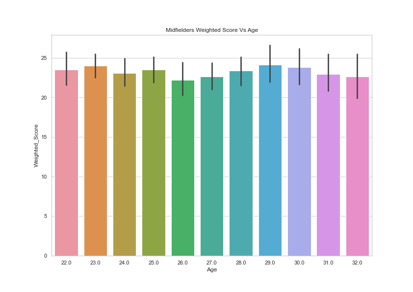
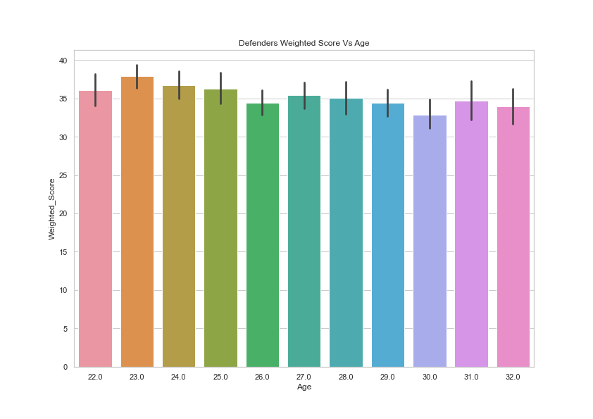

# Group 25B - Analysis by Ritvik Khurana

## Introduction:

The goal of this project is to reflect the skills we have learned in COSC 301 and apply them to a dataset of our choice to produce an analytical report. This report then helps us to reach our conclusions about our selected research questions we chose for this dataset. Our choosen dataset is the "2021-2022 Football Player Stats", this dataset contains an array of football player statistics and metrics that we can make use of in our analysis and to answer my research question **"To find the prime age of playing for this dataset and comparing it to top players in their prime"**.

## Dataset Reliability

Reliablity factors:

- Source: Open source public dataset uploaded by a fan
- Primary Source : Unknown
- Time Uploaded: ~May or June 2022
- How data was collected: Unknown
- Why was the dataset created: Hobbie/Unknown

Considering the factors mentioned above among others, I believe this dataset is a valid representation of Football player statistics from an enthusiast's point of view. Currently, the dataset doesn't contain very detailed data, the primary source and how the data was collected is Unknown, therefore we cannot consider it to be fully reliable data.

## Exploratory Data Analysis:

This graph shows us that most of the experienced players lie above the age of 22, as the box range significantly increases at that age compared to younger ages. However, we would expect that after a certain age the graph should start to dib back down. This does happen a little bit after the ages 29 and 30 but we don't see as much of a significant change as we did before. Moreover, as the ages increase beyond 30 we should see more dips in the graph, but, instead we see some increases at age 34 and 37. I believe this is due to some exceptional players bringing up the box for other players.

This graph is a treemap of players' ages where the size of each block/rectangle refers to the Sucessful Dribbles factor (The larger the size, the more dribbles in a certain age group). The grpah indicates that younger players (age : 22 - 24) have significantly more dribbles compared to older players. I believe this is because, dribbling is one of the many ways younger players improve. Dribbling helps them with better touches on the ball, more accurate passes. I think the younger players employ this stratagy due to them not being experienced enough, and therefore, still having the mindset they had on training grounds. 

## RQ : Find the prime age of playing for this dataset and compare it to top players currently in their prime.

For the following graphs, we have calculated a weighted score for each position considering facotrs that apply to that specific position.

**eg, For attackers I chose: Goals, Shots on target, Goal creating actions.**

This helps us to create a better visualisation as some of these factors are more important than others, therefore, adding a weightage to each factor according to their significance provides us with better data.

From the graph we can see that Attackers tend to peak between the ages 26 and 31, according to online sources such as "The Athletic", strikers can start to peek around 22 years old and may continue to peak until 31. Even though, they state that the prime age would be around 27, our results are still within their age range, therefore, confirming our analysis.

For this graph, we can see that the graph is fairly steady until it reaches the age 27, where the bars start to increase until 31, where they do fall a little but they still remain high compared to others. Therefore, we can identify that Midfielders peak between the ages 27 and 30. Which again have the same correlation with online source as the Attackers did. Attackers and Midfields do also seem to peak around the same age, which is again verified with general football statistics as they both seem to start peaking around 22 up until 31.

In this graph, we see some confusing results as it starts by peaking and decreases as age increases. This is not what we would expect as younger players don't have much overall experience and are still getting better with each game. I believe we see these results because the weightage of all the factors for defenders are quite close togehter, meaning that the weight being added aren't have much of an impact. Moreover, If I substitute midfielders for defenders in this graph, we see a similar result, this is because, midfielders and defenders have similar play styles which gets reflected. I have expimented with some other factors that I believe may have been better suited to capture defenders in their prime, however, most of them had the same result as shown by the trials below. Therefore, I can conclude that our analysis for defender's is insufficent and require more detailed data.

If you are interested you can [You can find the full analysis notebook here, including the code and the data here](/notebooks/analysis3.ipynb)

## Summary/Conclusion

Essentially, the dataset contains some very useful statistics that led to my conclusions, However, as mentioned in the Dataset Reliability section there are an array of details missing about the sources of the data. Therefore, this analysis is completly speculative and require more information about the dataset in order produce a concrete result.

From our analysis we are able to pin point certain age ranges for a football player to be in their prime, we considered the different positions players play and what factors may affect them. Using this information, we have come to the conclusion that young players, under the age of 24, haven't been explosed to enough gametime and are still partially in the trainning mindset. Therefore, we can eliminate them as potental players in their primes and continue our analysis. We then used the players' positions and suitable factors to compare them, coming to the conclustion that Attacker's and Midfielder's have similar prime ages of around 26 to 31. We then looked into our visualisation with more detail to find the strict limits for players in their prime using the same factors. As expected we found our ages to be 29-31 for Attackers and 29-30 for Midfielders, which both lie in our soft range. Unfortunately, we couldn't identify the prime age for defenders due to a lack of information regarding older players. We came to this conclusion after comparing then number of older players to younger, where we found that there are twice as many younger players as older with the seperation age being 28. Even though this may be true for all positions, I believe that there may be more anomalies or skewed data within the defenders. Therefore, leading us to this result. Lastly, I decided not to analyse goalkeepers simply due to the lack of relevant factors in the dataset for their position, hence, it logical to estimate their prime age.